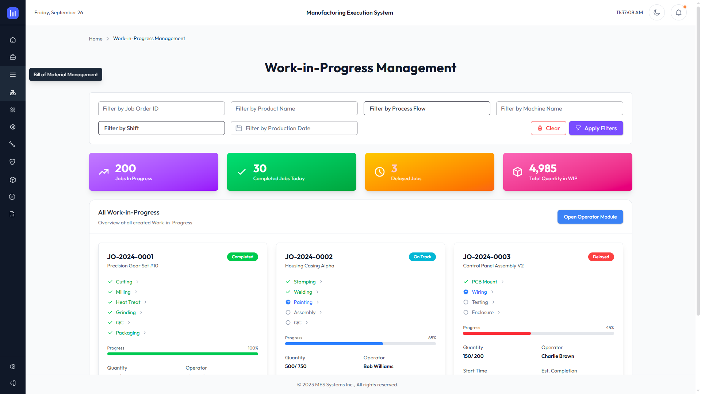

# 🚀 MES Vue

<div align="center">



### ✨ *The Ultimate Vue.js Admin Dashboard Experience* ✨

**Built with passion using Vue.js 3 & Tailwind CSS 4**

---

[](https://vuejs.org/)
[](https://tailwindcss.com/)
[](https://www.typescriptlang.org/)
[](https://vitejs.dev/)

**[🌟 Live Demo](https://free-vue-demo.tailadmin.com/) • [📖 Documentation](https://tailadmin.com/docs) • [💎 Pro Version](https://vue-demo.tailadmin.com)**

</div>

---

## 🎨 What Makes TailAdmin Vue Special?

<table>
<tr>
<td width="50%">

### 🎯 **Modern Architecture**
- **Vue 3 Composition API** with full TypeScript support
- **Vite** for lightning-fast development
- **Pinia** state management
- **Vue Router** for seamless navigation

</td>
<td width="50%">

### 💫 **Beautiful Design**
- **Tailwind CSS 4.x** utility-first styling
- Responsive across all devices
- Dark/Light theme support
- Professional UI components

</td>
</tr>
</table>

---

## 🌈 Features That'll Blow Your Mind

<div align="center">

| 🎨 **Design** | 🚀 **Performance** | 🔧 **Developer Experience** |
|:---:|:---:|:---:|
| Modern & Clean UI | Lightning Fast | TypeScript Ready |
| Dark/Light Themes | Optimized Bundle | Hot Module Replacement |
| Mobile Responsive | Tree Shaking | VS Code Extensions |
| Custom Components | Lazy Loading | Auto-completion |

</div>

---

## 🎪 Quick Start Magic

<details>
<summary>🎭 <strong>Click to reveal the installation spells!</strong></summary>

### 📋 Prerequisites
Before diving into the magic, ensure you have:

```bash
# Node.js (v18+ recommended, v20+ preferred)
node --version

# Your favorite IDE (we ❤️ VS Code + Volar)
```

### 🪄 Installation Wizard

```bash
# 1️⃣ Clone the repository
git clone https://github.com/TailAdmin/vue-tailwind-admin-dashboard.git

# 2️⃣ Navigate to project
cd vue-tailwind-admin-dashboard

# 3️⃣ Install dependencies
npm install
# or
yarn install
# or
pnpm install

# 4️⃣ Start development server
npm run dev

# 🎉 Open http://localhost:5173 and be amazed!
```

> **💡 Pro Tip for Windows Users:** Place the repository near your drive root (like `C:\projects\`) to avoid path length issues!

</details>

---

## 🎭 Explore All Flavors

<div align="center">

### 🌟 **Choose Your Adventure**

| Platform | Repository | Live Demo |
|:---:|:---:|:---:|
| 🟢 **Vue.js** | [GitHub](https://github.com/TailAdmin/vue-tailwind-admin-dashboard) | [Demo](https://free-vue-demo.tailadmin.com/) |
| ⚛️ **React** | [GitHub](https://github.com/TailAdmin/free-react-tailwind-admin-dashboard) | [Demo](https://free-react-demo.tailadmin.com/) |
| 🔺 **Angular** | [GitHub](https://github.com/TailAdmin/free-angular-tailwind-dashboard) | [Demo](https://free-angular-demo.tailadmin.com/) |
| ⚡ **Next.js** | [GitHub](https://github.com/TailAdmin/free-nextjs-admin-dashboard) | [Demo](https://free-nextjs-demo.tailadmin.com/) |
| 🌐 **HTML** | [GitHub](https://github.com/TailAdmin/tailadmin-free-tailwind-dashboard-template) | [Demo](https://free-html-demo.tailadmin.com/) |

</div>

---

## 🎨 Design Resources

<div align="center">

### 🎭 **From Design to Code**

**[🎨 Figma Design File](https://www.figma.com/community/file/1463141366275764364)** - Community Edition

*Perfect pixel designs ready for development*

</div>

---

## 🚀 Ready for Production?

<div align="center">

### 💎 **Unlock the Full Power**

**[⚡ Get PRO Version](https://tailadmin.com/pricing)**

*Premium components • Advanced layouts • Priority support*

**[📚 Comprehensive Documentation](https://tailadmin.com/docs)**

*Everything you need to build amazing dashboards*

</div>

---

## 🔧 Development Setup

### 🎯 **IDE Configuration**

For the best development experience:

- **VS Code** + **[Volar Extension](https://marketplace.visualstudio.com/items?itemName=Vue.volar)**
- Disable **Vetur** if installed
- Enable **TypeScript** support for `.vue` files

### ⚙️ **Type Support**

```json
// tsconfig.json is pre-configured for:
{
  "compilerOptions": {
    "types": ["vite/client"],
    "baseUrl": ".",
    "paths": {
      "@/*": ["src/*"]
    }
  }
}
```

---

## 🌟 Community & Support

<div align="center">

### 💬 **Join Our Amazing Community**

[](https://tailadmin.com)
[](https://tailadmin.com/docs)
[](https://tailadmin.com/download)

---

### 🎉 **Made with ❤️ by the TailAdmin Team**

*Empowering developers to build beautiful admin dashboards since day one*

**⭐ Star this repository if it helped you!**

</div>

---

<div align="center">
<sub><strong>TailAdmin Vue</strong> - Where beautiful design meets powerful functionality 🚀</sub>
</div>
